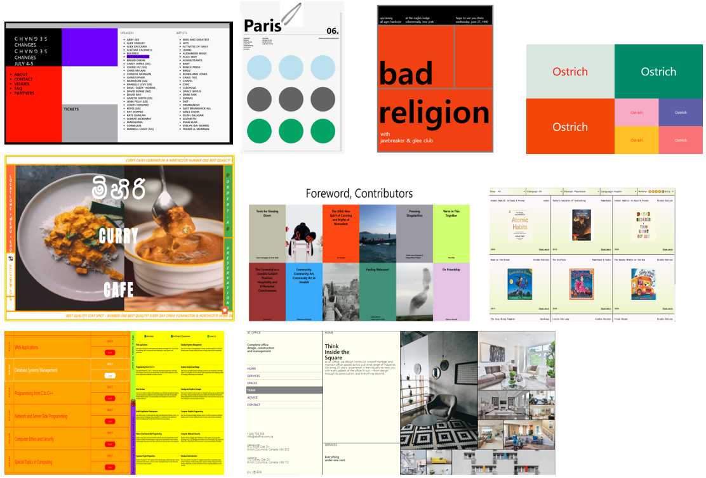

# ThinkFood
## Overview

This repository is for storing the sources to practice CSS Layout without any CSS framework.

## Core Technology Stack

* CSS3(SCSS)
    * Flexbox
    * Grid
    * SCSS using Gulp

## List of Results

>I practiced with the material from [NoMadCoders](https://nomadcoders.co/)
 
